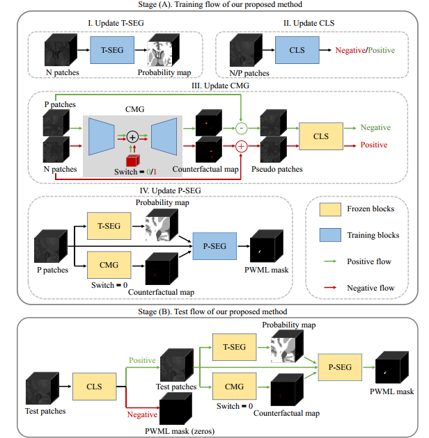

# DeepPWML

This repository provides the code for our MICCAI2023 paper "Punctate White Matter Lesion Segmentation in Preterm Infants Powered by Counterfactually Generative Learning".

We release our code in both TensorFlow and translated PyTorch versions of network. 

## Contents
- [DeepPWML](#deeppwml)
  - [Contents](#contents)
  - [Work-flow](#work-flow)
  - [Data-setting](#data-setting)
  - [Requirements](#requirements)
  - [Training](#training)
    - [T-SEG](#t-seg)
    - [CLS](#cls)
    - [CMG](#cmg)
    - [P-SEG](#p-seg)
  - [Testing](#testing)
  

## Work-flow

As shown in the picture, our DeepPMWL consists of four parts, i.e., the tissue segmentation module (T-SEG), the classification module (CLS), the counterfactual map generator (CMG), and the PWML segmentation module (P-SEG).
Specifically, in the training stage, T-SEG is learned on control data, while other modules are learned on PWML data.
Given an image patch as the input, CLS is trained to distinguish positive (containing PWML) or negative (no PWML) cases, based on which CMG is further trained to produce a counterfactual map to linearly manipulate the input to change the CLS result.

## Data-setting
The dataset contains control group and PWML group. All data is named as fellow. Each subject consists of T1 and label images for segmentation, for example "**subject-1-T1.nii**" (for the T1 image) and "**subject-1-label.nii**" (for its label image). The meanings of control data label are background(0), CSF(1), GM(2) and WM(3).  And the meanings of PWML data label are background(0) and PWML(1).

## Requirements
- python 3.8+
- tensorflow 2.4+
- Keras
- nibabel
  
## Training
### T-SEG
run **train_T-SEG.py**
### CLS
run **train_CLS.py**
### CMG
run **train_CMG.py**
### P-SEG
run **train_P-SEG.py**

## Testing
run **predict_DeepPWML.py**